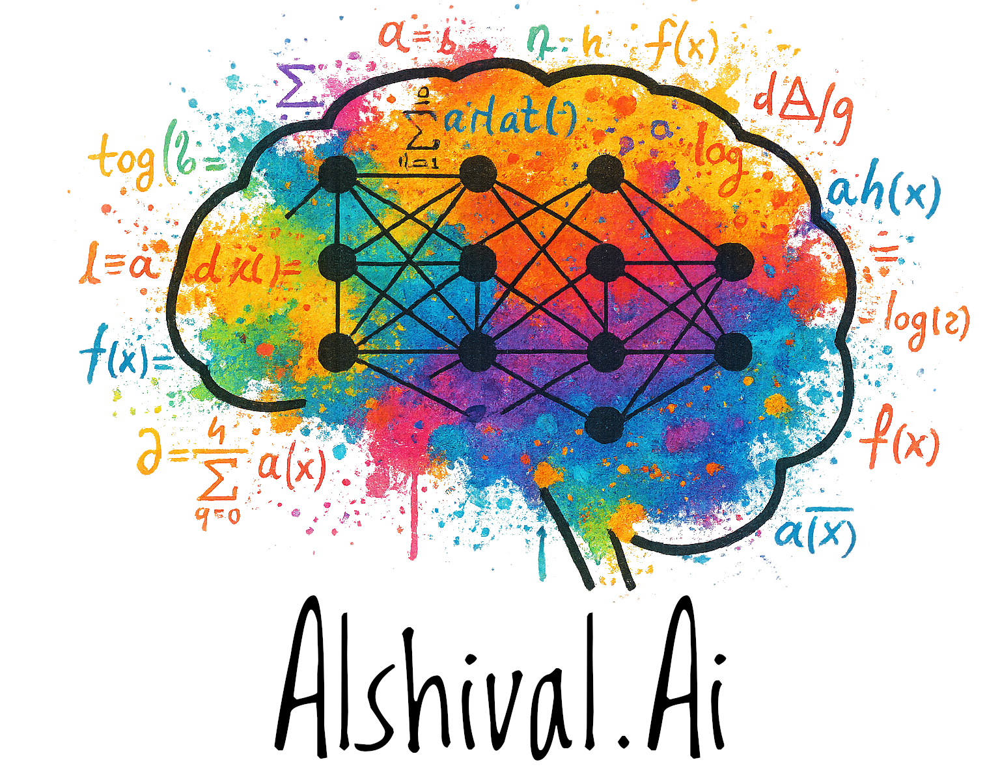

  

<h1 align="center">Alshival.Ai</h1>

  <strong>You take care of business. We'll take care of the data.</strong> 
  Alshival.Ai is a development workshop based in the Rio Grande Valley building practical agents, data systems, and internal tools.

<!-- 

  

 -->

  <a href="https://alshival.ai">Website</a> •
  <a href="https://alshival.ai/blog">Blog</a> •
  <a href="https://alshival.ai/services">Services</a> •
  <a href="https://alshival.ai/careers">Careers</a> •
  <a href="mailto:support@alshival.ai">support@alshival.ai</a>

---

## Who we are

Alshival.Ai is a dev workshop in the Rio Grande Valley. We build production software for teams that need working systems, clear operations, and agents that can interact with real business context instead of isolated demos.

## Alshival

We are actively building [Alshival](https://github.com/Alshival-Ai/alshival), an agent that uses GitHub Enterprise data to answer questions about repositories, engineering work, and project context.

It also integrates with Asana for project management and supports operational features including resource health monitoring and alerts for virtual machines, APIs, and other services, plus cloud logs, cloud alerts, and GitHub integration.

## What we do

- **AI Voice & Agents** - HIPAA-friendly voice agents, chatbots, and assistants integrated with your data and workflows.
- **Data Engineering** - Robust ETL/ELT pipelines, S3/MinIO object storage, and SQL warehouses built for reliability.
- **Analytics & BI** - Decision-ready dashboards and KPIs (Looker Studio / Power BI) with clean semantics and governance.
- **Machine Learning & MLOps** - Model development, evaluation, and deployment with monitoring, CI/CD, and reproducible training.
- **Cloud & DevOps** - OpenShift/Kubernetes, CI/CD, TLS and SSO, and automated infrastructure built for scale.
- **Security & Compliance** - Encryption, secrets management, audit logging, and HIPAA-aware patterns across the stack.

> Want to book time? Use the "Ask Alshival" widget on our site to schedule with the Data Team.

## How we work

We start with a short discovery to define goals, success metrics, data access, and timeline.
From there we run in weekly sprints with clear deliverables (dashboards, models, APIs).
You'll get demos at milestones, plus artifacts you can keep: code, docs, and deployment instructions.

## Agent-ready documentation

We also publish a reusable [`AGENTS.md`](./AGENTS.md) base that other organizations can adapt for their own repositories and agent workflows.

We keep that file intentionally short and operational instead of turning it into full project documentation. `AGENTS.md` works best as a stable instruction contract for coding and project-management agents, while the GitHub Wiki is where we maintain richer, changing technical and product context.

Our organization feeds GitHub Wiki content into project-management agents so they can answer technical and user questions about the codebase or the application with current repo-specific context.

## Security & sensitive data

We follow least-privilege access, encryption in transit/at rest, and environment isolation.
We can work in your VPC/VNet, on OpenShift/Kubernetes, or approved cloud services.
We also support HIPAA-aware delivery patterns (including GPT-powered copilots under a HIPAA BAA with OpenAI).

## Reports & research

- **Tesla Safety Report 2025** - https://alshival.ai/publications/tesla-safety-report-2025/
- **NHTSA Complaints Dashboard** - https://alshival.ai/publications/nhtsa-complaints-dashboard/
- **AlshiCrypt (encryption protocol)** - https://alshival.ai/publications/alshicrypt/

## The Data Team

- **Samuel** - Chief Data Scientist
- **Salvador** - Chief of Operations
- **Ruben** - Developer / Project Manager
- **Rafael** - The Intern
- **Juan** - Field Tech

**Contact:** support@alshival.ai • +1 (956) 420-6769  
Need a human follow-up? Ask the on-site agent to loop in the Data Team.

---

© Alshival.Ai - Made with love for a better web.
